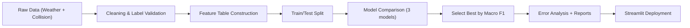

# London Road Collision Severity Classification

This project upgrades `casa0006_individual_work.ipynb` into a portfolio-ready classification research story:
**London traffic safety problem -> data quality challenge -> model comparison -> interpretation -> deployment**.

## 1) Problem Background
Road-collision severity is a practical safety signal for city management.  
Instead of only counting accidents, this project predicts severity levels:
- `1 = Fatal`
- `2 = Serious`
- `3 = Slight`

The objective is to turn coursework into a reproducible, explainable, and interview-ready ML workflow.

## 2) Project Goal
Build an end-to-end classification pipeline that can:
- clean and validate mixed-source data,
- compare multiple models fairly,
- explain what the model gets wrong,
- and expose results in a public Streamlit app.

## 3) Data Sources
- London weather data (Kaggle public dataset)
- UK DfT road collision records
- UK bank holidays (GOV.UK API)
- Demo sample file for reproducibility: `data/sample/merged_sample.csv`
- Planned public enrichments: OSM road attributes, London air quality, IMD (deprivation)

For full data download/merge, use:
```bash
python scripts/fetch_datasets.py --config configs/data.yaml --from 2015-01-01 --to 2024-12-31
python scripts/build_master_table.py --config configs/data.yaml
```

## 4) Data Quality Challenge (Why `-10` matters)
In real collision records, target labels may contain invalid values such as `-10`.  
If not handled, this can break training or silently bias results.

In this project:
- valid target space is strictly `{1, 2, 3}`,
- invalid target rows are filtered before model training,
- removed row count is logged as an artifact metric.

This cleaning decision is part of the model story, not just preprocessing noise.

## 5) Method & Decisions
### Pipeline flow


### Why these decisions
- Keep **3 severity classes**: preserves the public-safety granularity.
- Use **Macro F1** for selection: gives each class equal importance, including minority fatal class.
- Use **pre-event feature set** as default training mode: avoids post-event leakage in forward risk estimation.
- Compare 3 models:
  - Logistic Regression (interpretable baseline)
  - Random Forest (nonlinear, robust)
  - HistGradientBoosting (strong tabular baseline)

## 6) Results (Baseline Evidence First)
This repository now prioritizes **credible baseline evidence** over headline score.
If `data/processed/processed_master.parquet` is available, training uses it by default.
If not available, training falls back to the sample file for demo continuity.

Generated artifacts:
- `artifacts/metrics.json`
- `artifacts/metrics_cv.json`
- `artifacts/model_compare.csv`
- `artifacts/error_cases.csv`
- `artifacts/feature_importance.csv`
- `artifacts/data_quality_report.json`
- `artifacts/leakage_check_report.json`
- `artifacts/threshold_report.csv`
- `artifacts/calibration_report.json`
- `artifacts/hyperparameter_search.json`
- `artifacts/ablation_leakage.csv`
- `artifacts/missingness_by_time.csv`
- `reports/figures/model_comparison.png`
- `reports/figures/confusion_matrix.png`
- `reports/figures/feature_importance.png`

Interpretation emphasis:
- show model ranking by Accuracy + Macro F1,
- inspect confusion matrix (especially serious vs fatal boundary),
- review error cases and summarize observations,
- report reliability via stratified K-fold + time-based holdout,
- check leakage risk checklist and class imbalance (fatal precision/recall/F1),
- inspect threshold sensitivity and probability calibration for fatal class,
- include versioned evidence fields (`label_mapping_version`, `feature_set_mode`, `data_version_tag`).

## 7) Limitations & Next Step
Current limitations:
- weather missingness is high and can weaken meteorological interpretation,
- temporal/spatial features are still limited for fine-grained local inference,
- external enrichments (OSM, air quality, IMD) are placeholder-connected.

Next executable steps:
- run on larger processed master dataset (`data/processed/processed_master.parquet`),
- activate OSM/air quality/IMD enrichments,
- strengthen calibration, thresholding and class-balance strategies.

## 8) Reliability, Ethics, and Boundaries
- This project is for **risk estimation support**, not an automated enforcement decision system.
- Model outputs should be interpreted with uncertainty awareness and human oversight.
- Data quality and representativeness limits are explicitly logged in artifacts and UI.

## Reproducible Command Chain
```bash
python3 -m venv .venv
source .venv/bin/activate
pip install -r requirements.txt
python scripts/fetch_datasets.py --config configs/data.yaml --from 2015-01-01 --to 2024-12-31
python scripts/build_master_table.py --config configs/data.yaml
python -m src.train --config configs/default.yaml
python -m src.evaluate --config configs/default.yaml
python -m src.predict --config configs/default.yaml --input-file examples/sample_input.json
streamlit run app/streamlit_app.py
```

## Public Interfaces
- Train: `python -m src.train --config configs/default.yaml`
- Evaluate: `python -m src.evaluate --config configs/default.yaml`
- Predict: `python -m src.predict --config configs/default.yaml --input-file examples/sample_input.json`
- Fetch data: `python scripts/fetch_datasets.py --config configs/data.yaml --from 2015-01-01 --to 2024-12-31`
- Build master: `python scripts/build_master_table.py --config configs/data.yaml`
- App entry: `app/streamlit_app.py`
- New evidence artifacts:
  - `artifacts/data_quality_report.json`
  - `artifacts/leakage_check_report.json`
  - `artifacts/threshold_report.csv`
  - `artifacts/calibration_report.json`

---

# 中文版（Chinese Version）

## 1) 问题背景
本项目聚焦伦敦道路交通安全，不只统计事故数量，而是预测事故严重程度：
- `1 = 致命`
- `2 = 严重`
- `3 = 轻微`

目标是把课程作业升级为可复现、可解释、可展示、可面试深挖的机器学习项目。

## 2) 项目目标
搭建端到端分类流程，实现：
- 多源数据清洗与标签治理，
- 多模型对比与可审计选型，
- 误差分析与可靠性验证，
- Streamlit 在线展示与交互预测。

## 3) 数据来源
- 伦敦天气数据（Kaggle 公开数据）
- 英国 DfT 道路碰撞数据
- 英国法定节假日（GOV.UK API）
- 演示样本数据：`data/sample/merged_sample.csv`
- 计划补全：OSM 路网属性、伦敦空气质量、IMD（贫困脆弱性）数据

全量数据流程命令：
```bash
python scripts/fetch_datasets.py --config configs/data.yaml --from 2015-01-01 --to 2024-12-31
python scripts/build_master_table.py --config configs/data.yaml
```

## 4) 数据质量挑战（为什么 `-10` 很关键）
真实碰撞数据中目标标签可能出现无效值（如 `-10`）。若不处理，会导致训练失败或结果偏差。  
本项目将目标标签严格限制在 `{1,2,3}`，并记录被剔除的异常样本数量，作为数据治理证据。

## 5) 方法与关键决策
- 保留三分类：保留安全场景语义，不简化为二分类。
- 指标用 Macro F1：避免多数类掩盖少数类（尤其 fatal）表现。
- 默认采用 pre-event 特征集合训练主模型：减少后验信息泄漏风险。
- 模型对比：Logistic Regression / Random Forest / HistGradientBoosting。
- 可靠性验证：Stratified K-Fold + 时间外推切分（time-based holdout）。

## 6) 结果与产物（先可信，再提分）
当前仓库默认优先产出可信基线证据。若存在 `data/processed/processed_master.parquet`，训练默认使用主表。  
若主表暂未构建，则自动回退到样本文件，保证演示流程可运行。  
核心产物包括：
- `artifacts/metrics.json`
- `artifacts/metrics_cv.json`
- `artifacts/model_compare.csv`
- `artifacts/error_cases.csv`
- `artifacts/feature_importance.csv`
- `artifacts/data_quality_report.json`
- `artifacts/leakage_check_report.json`
- `artifacts/threshold_report.csv`
- `artifacts/calibration_report.json`
- `artifacts/hyperparameter_search.json`
- `artifacts/ablation_leakage.csv`
- `artifacts/missingness_by_time.csv`
- `reports/figures/*.png`

## 7) 局限与下一步
当前局限：
- 样本规模偏小，指标可能偏乐观；
- 时空特征仍有限；
- OSM/空气质量/IMD 仍是占位接入，待进一步打通。

下一步：
- 在 `data/processed/processed_master.parquet` 上做更大规模训练；
- 完成外部公开数据补全；
- 强化校准、阈值策略与类别不平衡处理。

## 8) 复现命令链
```bash
python3 -m venv .venv
source .venv/bin/activate
pip install -r requirements.txt
python scripts/fetch_datasets.py --config configs/data.yaml --from 2015-01-01 --to 2024-12-31
python scripts/build_master_table.py --config configs/data.yaml
python -m src.train --config configs/default.yaml
python -m src.evaluate --config configs/default.yaml
python -m src.predict --config configs/default.yaml --input-file examples/sample_input.json
streamlit run app/streamlit_app.py
```
