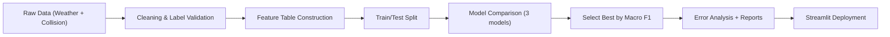

# London Road Collision Severity Classification

This project upgrades `casa0006_individual_work.ipynb` into a portfolio-ready classification research story:
**London traffic safety problem -> data quality challenge -> model comparison -> interpretation -> deployment**.

## 1) Problem Background
Road-collision severity is a practical safety signal for city management.  
Instead of only counting accidents, this project predicts severity levels:
- `1 = Slight`
- `2 = Serious`
- `3 = Fatal`

The objective is to turn coursework into a reproducible, explainable, and interview-ready ML workflow.

## 2) Project Goal
Build an end-to-end classification pipeline that can:
- clean and validate mixed-source data,
- compare multiple models fairly,
- explain what the model gets wrong,
- and expose results in a public Streamlit app.

## 3) Data Sources
- London weather data (Kaggle public dataset)
- UK DfT road collision records
- UK bank holidays (GOV.UK API)
- Demo sample file for reproducibility: `data/sample/merged_sample.csv`
- Planned public enrichments: OSM road attributes, London air quality, IMD (deprivation)

For full data download/merge, use:
```bash
python scripts/fetch_datasets.py --config configs/data.yaml --from 2015-01-01 --to 2024-12-31
python scripts/build_master_table.py --config configs/data.yaml
```

## 4) Data Quality Challenge (Why `-10` matters)
In real collision records, target labels may contain invalid values such as `-10`.  
If not handled, this can break training or silently bias results.

In this project:
- valid target space is strictly `{1, 2, 3}`,
- invalid target rows are filtered before model training,
- removed row count is logged as an artifact metric.

This cleaning decision is part of the model story, not just preprocessing noise.

## 5) Method & Decisions
### Pipeline flow


### Why these decisions
- Keep **3 severity classes**: preserves the public-safety granularity.
- Use **Macro F1** for selection: gives each class equal importance, including minority fatal class.
- Compare 3 models:
  - Logistic Regression (interpretable baseline)
  - Random Forest (nonlinear, robust)
  - HistGradientBoosting (strong tabular baseline)

## 6) Results (Sample Demo Performance)
This repository intentionally provides **sample demo performance** (small dataset for reproducibility).

Generated artifacts:
- `artifacts/metrics.json`
- `artifacts/metrics_cv.json`
- `artifacts/model_compare.csv`
- `artifacts/error_cases.csv`
- `artifacts/feature_importance.csv`
- `reports/figures/model_comparison.png`
- `reports/figures/confusion_matrix.png`
- `reports/figures/feature_importance.png`

Interpretation emphasis:
- show model ranking by Accuracy + Macro F1,
- inspect confusion matrix (especially serious vs fatal boundary),
- review error cases and summarize observations,
- report reliability via stratified K-fold + time-based holdout.

## 7) Limitations & Next Step
Current limitations:
- sample dataset is small, results may be optimistic,
- temporal/spatial features are limited,
- external enrichments (OSM, air quality, IMD) are placeholder-connected.

Next executable steps:
- run on larger processed master dataset (`data/processed/processed_master.parquet`),
- activate OSM/air quality/IMD enrichments,
- strengthen calibration, thresholding and class-balance strategies.

## 8) Reliability, Ethics, and Boundaries
- This project is for **risk estimation support**, not an automated enforcement decision system.
- Model outputs should be interpreted with uncertainty awareness and human oversight.
- Data quality and representativeness limits are explicitly logged in artifacts and UI.

## Reproducible Command Chain
```bash
python3 -m venv .venv
source .venv/bin/activate
pip install -r requirements.txt
python scripts/fetch_datasets.py --config configs/data.yaml --from 2015-01-01 --to 2024-12-31
python scripts/build_master_table.py --config configs/data.yaml
python -m src.train --config configs/default.yaml
python -m src.evaluate --config configs/default.yaml
python -m src.predict --config configs/default.yaml --input-file examples/sample_input.json
streamlit run app/streamlit_app.py
```

## Public Interfaces
- Train: `python -m src.train --config configs/default.yaml`
- Evaluate: `python -m src.evaluate --config configs/default.yaml`
- Predict: `python -m src.predict --config configs/default.yaml --input-file examples/sample_input.json`
- Fetch data: `python scripts/fetch_datasets.py --config configs/data.yaml --from 2015-01-01 --to 2024-12-31`
- Build master: `python scripts/build_master_table.py --config configs/data.yaml`
- App entry: `app/streamlit_app.py`
